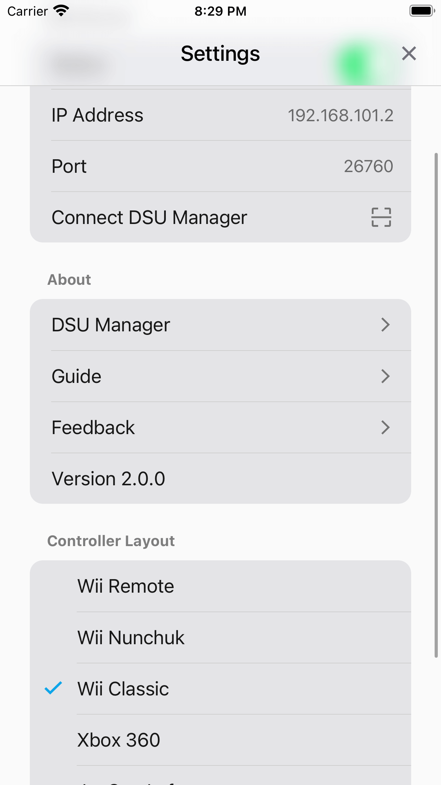

# DSUController Guides

DSUController (means DualShock UDP controller) is a mobile app based on [cemuhook-protocol](https://github.com/v1993/cemuhook-protocol) to simulate some game controllers.
It can be used with [Cemu](http://cemu.info/) using [Cemuhook](https://sshnuke.net/cemuhook/), [Citra](https://citra-emu.org/), [Dolphin](https://dolphin-emu.org/), [Yuzu](https://yuzu-emu.org/) and other more game console emulators.

## Download

 
 

## Screenshots

## Run with [Dolphin](https://dolphin-emu.org/)

1. Open **Controller Settings** on Dolphin,
2. Click **Alternate Input Sources**,
3. Check **Enable**,
4. Click **Add...**, input the DSUController's IP address and port number (find them on the settings page),

    

5. Select `Emulated Wii Remote` as **Wii Remote 1** and click **Configure**,
6. Select `DSUClient/1/` as **Device**,
7. Download <a href="configs/dolphin/DSUController.ini" download="DSUController.ini">DSUController.ini</a> into the Dolphin Config folder:
    > * windows: `~/Documents/Dolphin\ Emulator/Config/Profiles/Wiimote/`
    > * macOS: `~/Library/Application\ Support/Dolphin/Config/Profiles/Wiimote/`
8. Select `DSUController` as **Profile**, and click **load**,

    

9. Close **Controller Settings** and start some games to have fun.

### FAQ

1. Why doesn't `DSUClient/x/` appear on Dolphin's Devices list?
    > Try to restart the DSU server or relaunch the app. 
    > Make sure the app and emulator are on the same Wi-Fi network, and [Local Network Access](https://support.apple.com/en-us/HT211870) is enabled on the app.
2. Can it rumble?
    > Yes, but the [PR](https://github.com/dolphin-emu/dolphin/pull/11545) for this feature is not merged currently. 
    > You can download the trial version of Dolphin Emulator from this [action artifacts](https://github.com/breeze2/dolphin/actions/runs/4314377128). 
    > Click **Motor**, and select `Motor 0` or `Motor 1` on **Configure Output** window. The phone will vibrate when you click **Test**. 
    > 
3. Can it simulate Wii Nunchuk?
    > Yes, but you need two smartphones. 
    > First, download <a href="configs/dolphin/DSUController_with_Nunchuk.ini" download="DSUController_with_Nunchuk.ini">DSUController_with_Nunchuk.ini</a> into the Dolphin Config folder. 
    > Then select `DSUController_with_Nunchuk` as **Profile** on Dolphin Emulator controller settings window and load it. 
    > Make sure the phone `DSUClient/1/` uses layout `Wii Remote` and the phone `DSUClient/0/` uses layout `Wii Nunchuk` on DSUController settings page. 
    > 
    > 
4. Can it simulate Wii Classic Controller?
    > Yes. 
    > First, download <a href="configs/dolphin/DSUController_with_Classic.ini" download="DSUController_with_Classic.ini">DSUController_with_Classic.ini</a> into the Dolphin Config folder. 
    > Then select `DSUController_with_Classic` as **Profile** on Dolphin Emulator controller settings window and load it. 
    > 
    > 

## Run with DSU Manager (on Windows)

> Only supports windows at present

1. Download and install latest [ViGEmBus](https://github.com/ViGEm/ViGEmBus/releases).
2. Download and install latest [DSU Manager](https://github.com/breeze2/dsu-manager-guides/releases).
3. Open DSU Manager, and click **Start**, you will get a QRCode.
    > 
    > 
4. Open the settings page on DSU Controller (v2.0 at least), click **Connect DSU Manager**, and then scan the QRCode.
    > 
    > 
5. Now you get a virtual XInput controller, you can use it to play any games on your PC 🎉🎉🎉.

## Run with [yuzu](https://github.com/yuzu-emu/yuzu) (on Windows)

1. Similarly, you need to have [ViGEmBus](https://github.com/ViGEm/ViGEmBus/releases) and [DSU Manager](https://github.com/breeze2/dsu-manager-guides/releases) installed first.
2. Make sure DSU Controller is connected with DSU Manager.
3. Open the settings page on DSU Controller, select `Xbox 360` or `JoyCon Left` as **Controller Layout**.
4. Open the **yuzu Configuration** window, select **Controls** tab, select `Pro Controller` or`Left JoyCon` as **Connect Controller**, and select `Xbox 360 Controller 0` as **Input Device**, then yuzu will complete button mappings automatically.
    > 
5. Check the **Vibration**.
6. Check the **Motion**, Click **Motion Configure**.
7. Open the **Configure Motion/Touch** window, add CemuhookUDP server (you can find the ip and port on DSU Manager), then click **OK** to close this window.
    > 
    > 
8. Click **Motion1 [not set]** or **Motion1 [mouse]**, shake your phone, it will change to **Motion1 [cemuhookudp]**.
9. Next just enjoy your game on yuzu 🎉🎉🎉.

## Magic combination Keys

1. Select one magic layout, like `Xbox 360 Lite Magic`, or `JoyCon Left Magic` (v2.1 at least).
2. Configure combination keys.
3. For example, configure as shown, then press the `🔼` button and move, it will trigger the `L`(move to right) or `ZL`(move to left) pressing.
    > 
    > 

## Privacy & Terms

- [Privacy](https://breeze2.github.io/dsu-controller-guides/privacy)
- [Terms & Conditions](https://breeze2.github.io/dsu-controller-guides/terms)
