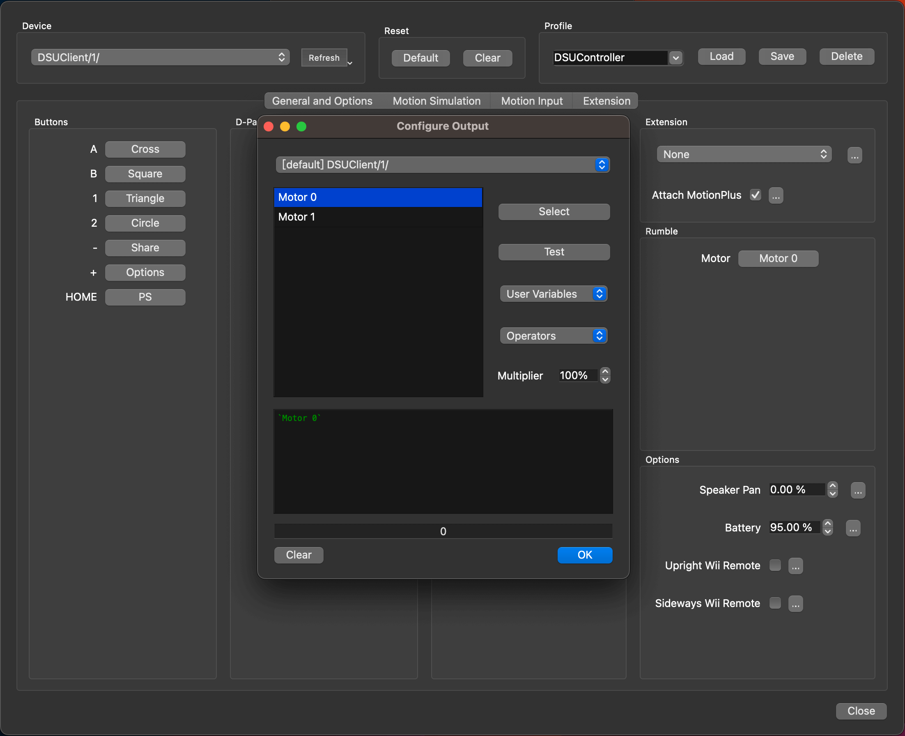
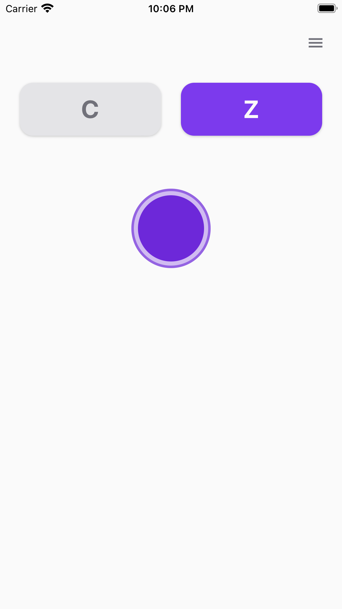
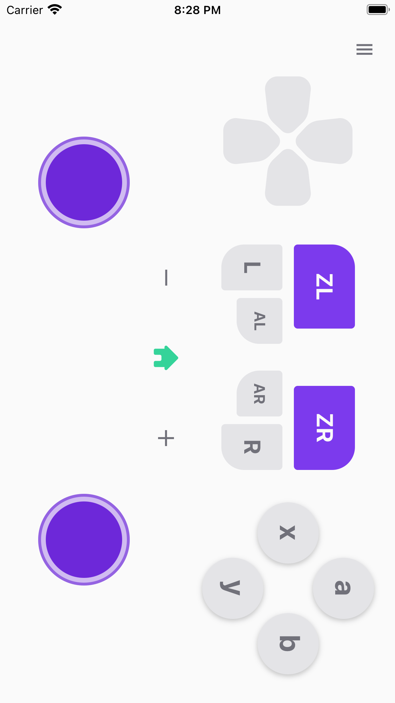

# DSUController Guides

DSUController (means DualShock UDP controller) is a mobile app based on [cemuhook-protocol](https://github.com/v1993/cemuhook-protocol) to simulate some game controllers.
It can be used with [Cemu](http://cemu.info/) using [Cemuhook](https://sshnuke.net/cemuhook/), [Citra](https://citra-emu.org/), [Dolphin](https://dolphin-emu.org/), [Yuzu](https://yuzu-emu.org/) and other more game console emulators.

## Download

 
 

## Screenshots

## Run with Dolphin

1. Open **Controller Settings** on Dolphin,
2. Click **Alternate Input Sources**,
3. Check **Enable**,
4. Click **Add...**, input the DSUController's IP address and port number (find them on the settings page),

    

5. Select `Emulated Wii Remote` as **Wii Remote 1** and click **Configure**,
6. Select `DSUClient/0/` as **Device**,
7. Download <a href="configs/dolphin/DSUController.ini" download="DSUController.ini">DSUController.ini</a> into the Dolphin Config folder:
    > * windows: `~/Documents/Dolphin\ Emulator/Config/Profiles/Wiimote/`
    > * macOS: `~/Library/Application\ Support/Dolphin/Config/Profiles/Wiimote/`
8. Select `DSUController` as **Profile**, and click **load**,

    

9. Close **Controller Settings** and start some games to have fun.

### FAQ

1. Why doesn't `DSUClient/x/` appear on Dolphin's Devices list?
    > Try to restart the DSU server or relaunch the app. 
    > Make sure the app and emulator are on the same Wi-Fi network, and [Local Network Access](https://support.apple.com/en-us/HT211870) is enabled on the app.
2. Can it rumble?
    > Yes, but the [PR](https://github.com/dolphin-emu/dolphin/pull/11545) for this feature is not merged currently. 
    > You can download the trial version of Dolphin Emulator from this [action artifacts](https://github.com/breeze2/dolphin/actions/runs/4314377128). 
    > Click **Motor**, and select `Motor 0` or `Motor 1` on **Configure Output** window. The phone will vibrate when you click **Test**. 
    > 
3. Can it simulate Wii Nunchuk?
    > Yes, but you need two smartphones. 
    > First, download <a href="configs/dolphin/DSUController_with_Nunchuk.ini" download="DSUController_with_Nunchuk.ini">DSUController_with_Nunchuk.ini</a> into the Dolphin Config folder. 
    > Then select `DSUController_with_Nunchuk` as **Profile** on Dolphin Emulator controller settings window and load it. 
    > Make sure phone `DSUClient/0/` uses layout `Wii Remote` and phone `DSUClient/1/` uses layout `Wii Nunchuk` on DSUController settings page. 
    > 
    > 
4. Can it simulate Wii Classic Controller?
    > Yes. 
    > First, download <a href="configs/dolphin/DSUController_with_Classic.ini" download="DSUController_with_Classic.ini">DSUController_with_Classic.ini</a> into the Dolphin Config folder. 
    > Then select `DSUController_with_Classic` as **Profile** on Dolphin Emulator controller settings window and load it. 
    > When you touch `L` (or `R`), it will trigger the `L-Analog` (or `R-Analog`). Touch `L` (or `R`) and move out, it will trigger the real `L` (or `R`). 
    > 
    > 

## Privacy & Terms

- [Privacy](https://breeze2.github.io/dsu-controller-guides/privacy)
- [Terms & Conditions](https://breeze2.github.io/dsu-controller-guides/terms)